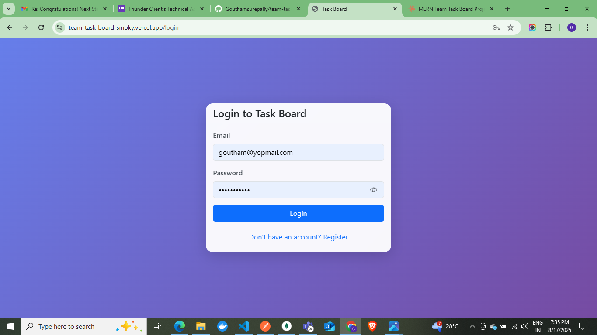
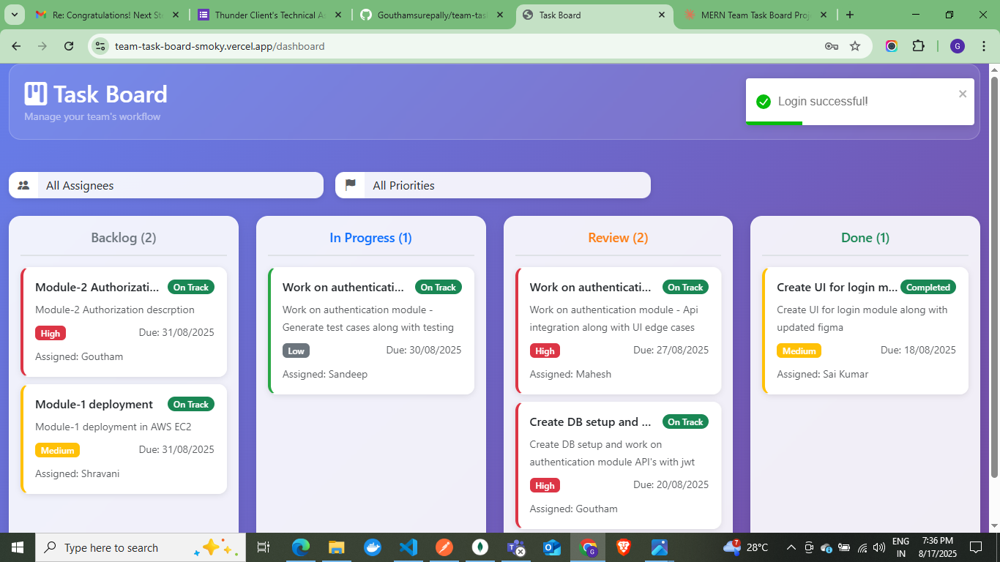
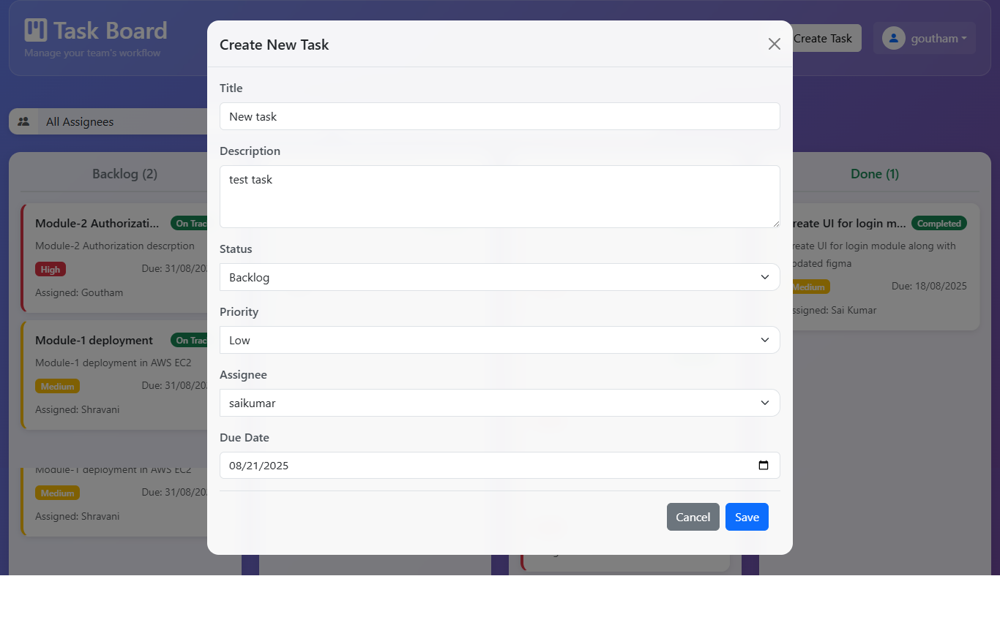
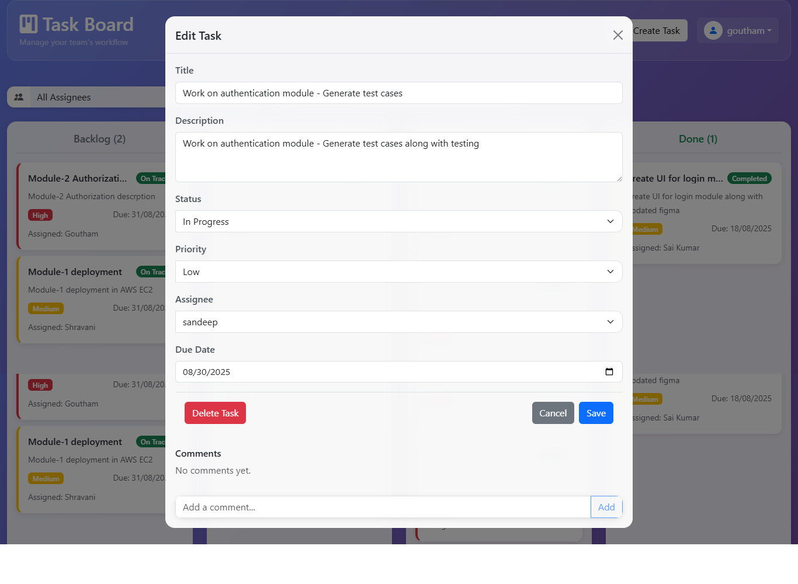
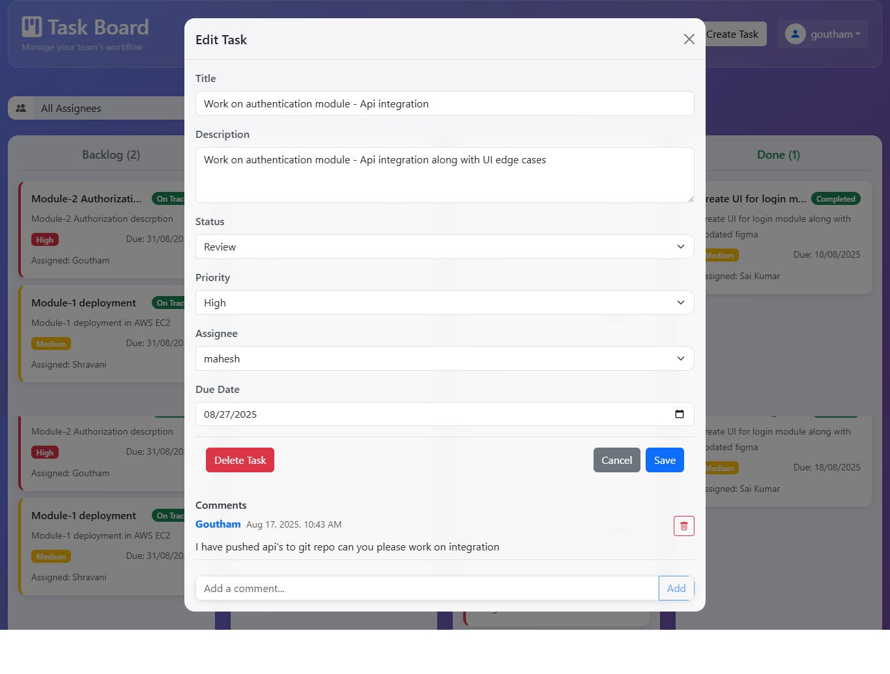
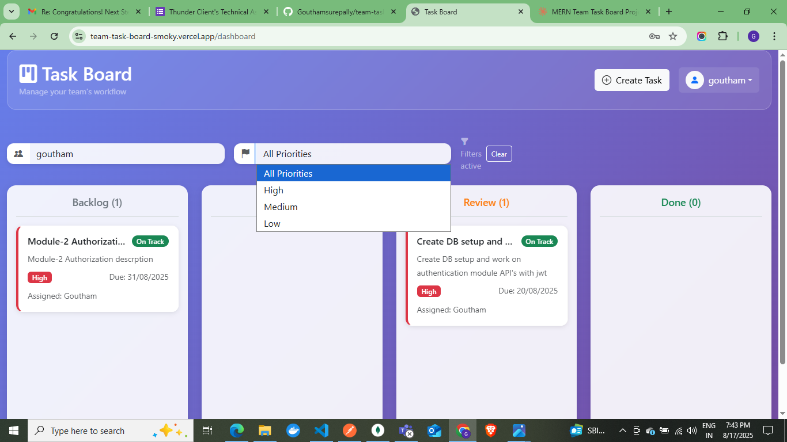
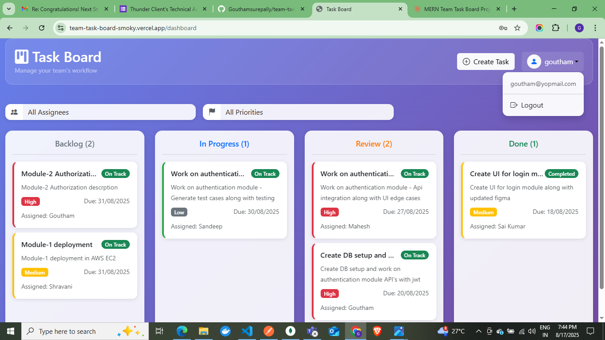

# Task Board Frontend

A React-based frontend for the Task Board application that allows teams to manage tasks in a Kanban-style board.

## Features

- **User Authentication**: Login and registration with JWT tokens
- **Task Management**: Create, edit, delete, and move tasks between columns
- **Kanban Board**: 4 columns (Backlog, In Progress, Review, Done)
- **Status Badges**: Visual indicators showing task status (On Track, At Risk, Overdue)
- **Priority System**: High, Medium, and Low priority tasks with color coding
- **Filters**: Filter tasks by assignee and priority
- **Drag & Drop**: Move tasks between columns by dragging
- **Comments**: Add and view comments on tasks
- **Responsive Design**: Works on desktop and mobile devices

## Technology Stack

- React 18
- Bootstrap 5.3
- Axios for API calls
- Context API for state management

## Prerequisites

- Node.js (version 14 or higher)
- npm or yarn

## Installation

1. Install dependencies:
```bash
npm install
```

2. Set up environment variables (optional):
Create a `.env` file in the root directory:
```
REACT_APP_API_URL=http://localhost:8000
```

3. Start the development server:
```bash
npm start
```

The application will open at `http://localhost:3000`

## Project Structure

```
src/
├── components/          # React components
│   ├── Login.js        # Login form component
│   ├── Register.js     # Registration form component
│   ├── TaskBoard.js    # Main kanban board component
│   ├── TaskCard.js     # Individual task card component
│   └── TaskModal.js    # Task creation/editing modal
├── context/            # React context providers
│   └── AuthContext.js  # Authentication context
├── utils/              # Utility functions
│   └── api.js          # API service functions
├── App.js              # Main app component
├── index.js            # Entry point
└── index.css           # Global styles
```

## Component Overview

### TaskBoard
The main component that displays the Kanban board with 4 columns. Handles:
- Task fetching and state management
- Drag and drop functionality
- Filtering tasks by assignee and priority
- User authentication status

### TaskCard
Individual task display component showing:
- Task title and description
- Priority indicators (color-coded borders)
- Status badges (On Track, At Risk, Overdue)
- Assignee information
- Due date

### TaskModal
Modal component for creating and editing tasks. Features:
- Task form with all required fields
- Comments section for existing tasks
- Delete functionality
- Form validation

### Authentication Components
- **Login**: User login form with error handling
- **Register**: User registration form with password confirmation

## Status Badge Logic

- **On Track**: Due date more than 24 hours away
- **At Risk**: Due date within 24 hours
- **Overdue**: Past due date and not in "Done" status

## API Integration

The frontend communicates with the backend API using the following endpoints:

### Authentication
- `POST /auth/register` - User registration
- `POST /auth/login` - User login
- `GET /auth/users` - Get all users (for assignee dropdown)

### Tasks
- `GET /tasks/get-all-tasks` - Fetch all tasks
- `POST /tasks/create-task` - Create new task
- `PUT /tasks/update-task/:id` - Update existing task
- `DELETE /tasks/delete-task/:id` - Delete task
- `PATCH /tasks/:id/move` - Move task to different column

### Comments
- `GET /comments/get-comment-for-task/:taskId` - Get task comments
- `POST /comments/create-comment/:taskId` - Add comment to task
- `DELETE /comments/delete-comment/:id` - Delete comment

## Available Scripts

- `npm start` - Runs the app in development mode
- `npm build` - Builds the app for production
- `npm test` - Launches the test runner
- `npm eject` - Ejects from Create React App (one-way operation)

## Browser Support

This application supports all modern browsers including:
- Chrome (latest)
- Firefox (latest)
- Safari (latest)
- Edge (latest)

## Future Enhancements

- Real-time updates using WebSockets
- Task templates
- File attachments
- Advanced filtering options
- Team management features
- Email notifications

## UI Images

-Register 
.png>)
-Login

-Dashboard

-Create Task

-Update and Delete tasks and also add comment

-Get and delete comments

-Filters for assignees and priorities

-Logout and profile
